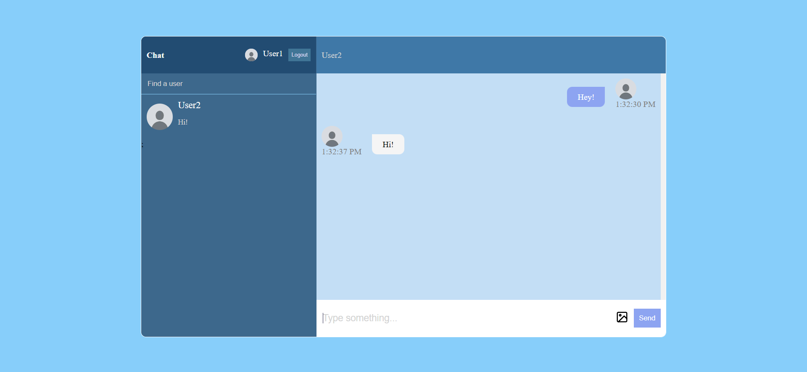

# Realtime Chat Web Application using React and Firebase

This repository contains a simple yet effective realtime chat web application built using React for the frontend and Firebase for the backend. The application allows users to engage in real-time conversations, making it suitable for various communication purposes.

## Features

- **Realtime Messaging:** Users can exchange messages in real-time, providing a seamless and instant communication experience.
- **User Authentication:** The application utilizes Firebase Authentication to securely manage user registration and login processes.

## Technologies Used

- **React:** The frontend is built using React, a popular JavaScript library for building user interfaces.
- **Firebase:** Firebase is used as the backend infrastructure, offering features like realtime database, authentication, and more.
- **Firebase Authentication:** User registration and authentication are handled using Firebase's built-in authentication services.
- **Firebase Realtime Database:** The application uses Firebase Realtime Database to store and sync chat messages in real-time.
- **CSS:** The application is styled using CSS to create an intuitive and visually appealing user interface.
